# Expose Auth0-enabled OpenWhisk actions with API Connect

This project looks at how <a href="https://console.bluemix.net/catalog/services/APIConnect">API Connect</a> can be used to expose OpenWhisk actions while integrating with a third-party identity platform like <a href="https://auth0.com/">Auth0</a> to secure the API.

## Overview

Built using the IBM Bluemix, the project uses:
* IBM Bluemix OpenWhisk to implement the backend API
* API Connect to expose the API
* [Auth0](https://auth0.com/) to secure the API

The API defines two methods `GET /pets` and `POST /pets` to retrieve a list of pets and add one. The methods are implemented as [OpenWhisk actions](./actions).

When calling the API, the user passes the token obtained from Auth0 as Authorization header.

In API Connect, the JWK keys to verify the token are retrieved from Auth0 - and cached. Then the token is validated and the call to OpenWhisk can be made. The OpenWhisk action result is returned.

   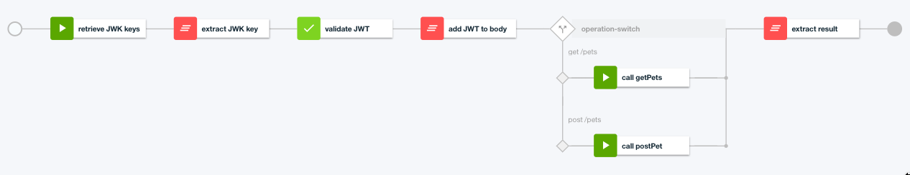


## Application Requirements

* IBM Bluemix account. [Sign up][bluemix_signup_url] for Bluemix, or use an existing account.
* Auth0 account. [Sign up](https://auth0.com/) for a free account.

## Deploying the application to Bluemix

### Configure Auth0

1. Log in your Auth0 account

1. Select Clients

   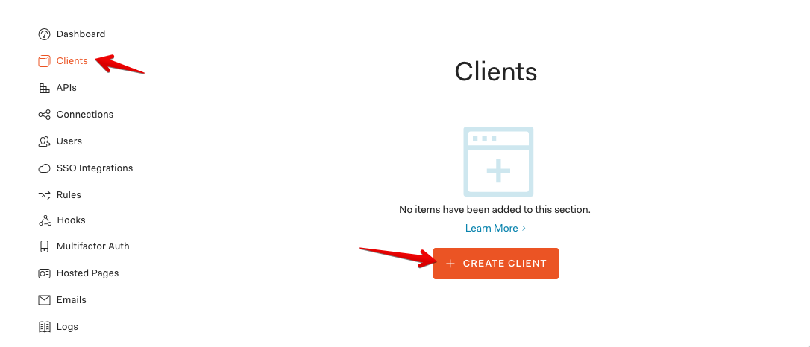

1. Create a new client
   * Set the name to Petstore client
   * Select Non Interactive Clients

   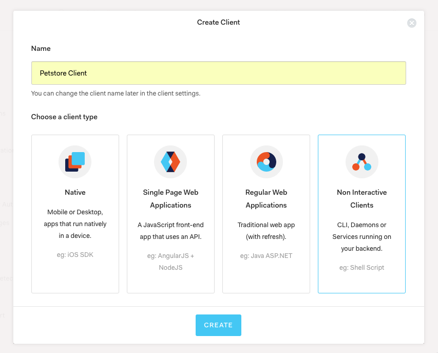

1. Select the APIs link

   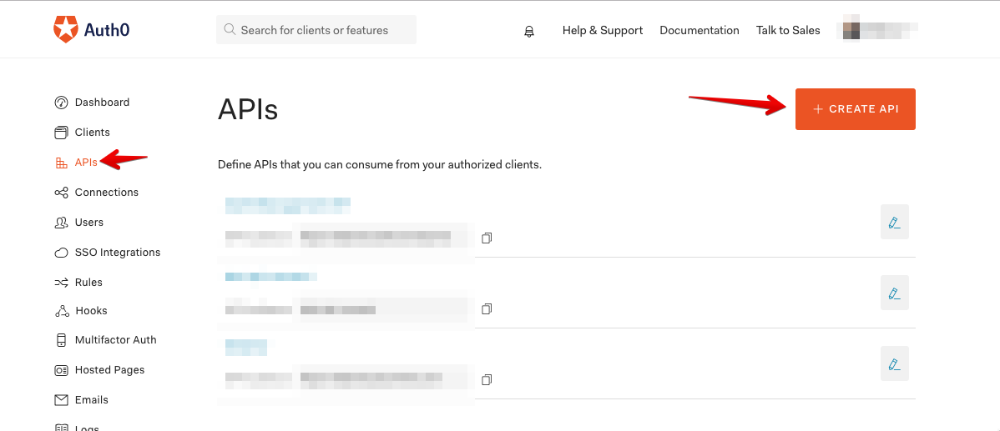

1. Click Create API

1. Fill in the details
   * Set name to Petstore
   * Set identifier to https://petstore.apiconnect.com
   * Set algorithm to RS256

   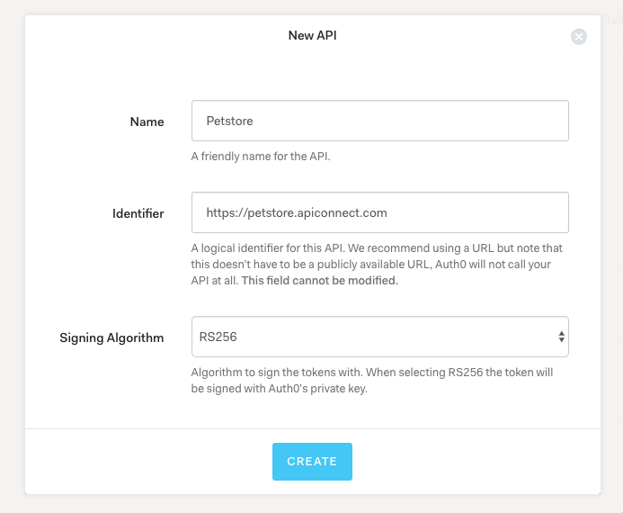

1. Click Create

1. In the Scopes section create new scopes called read and write and add a description.

   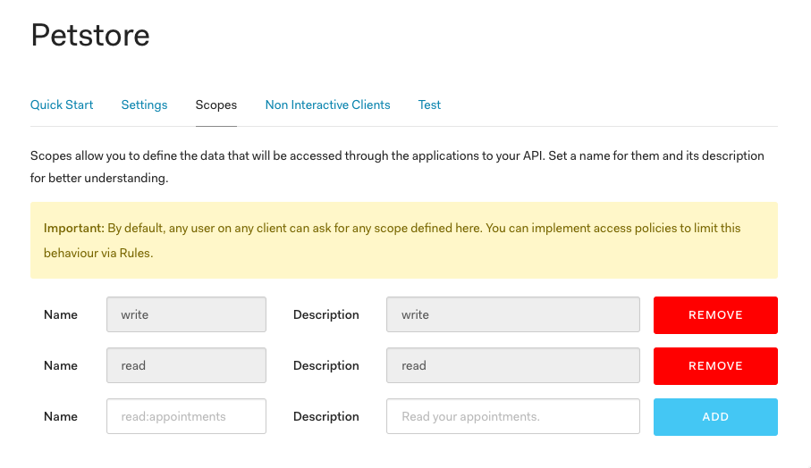

1. In the Non Interactive Clients section, expand the Petstore Client and select the previously created scopes and click Update. Click Continue to accept the warning message.

   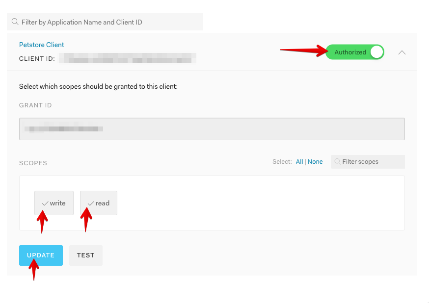

1. In the Test section, you can either copy and paste the curl command or keep the page open. Later we will use this sample access_token that has been generated there.

   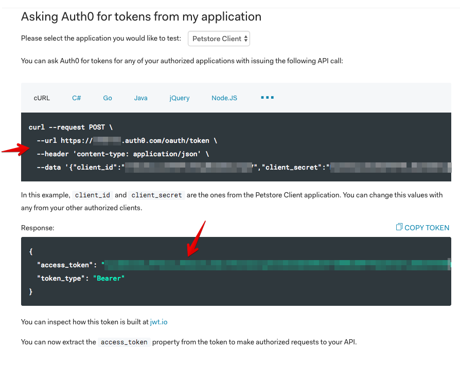

### Deploy the OpenWhisk actions

1. Clone or fork the repository https://github.com/IBM-Bluemix/openwhisk-apic-auth0

1. Checkout the code

1. Ensure your [OpenWhisk command line interface](https://console.ng.bluemix.net/openwhisk/cli) is property configured with:

   ```
   wsk list
   ```

   This shows the packages, actions, triggers and rules currently deployed in your OpenWhisk namespace.

1. Deploy the actions to OpenWhisk

   ```
   ./deploy.sh --install
   ```

### Import the API in API Connect

1. Create an API Connect service in Bluemix

1. Under Drafts, select APIs

   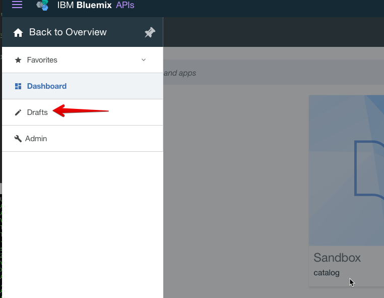

1. Select Import API from a file or URL

   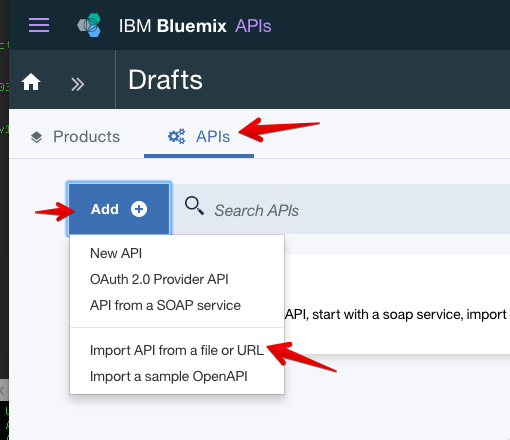

1. Point to api/petstore-api_1.0.0.yaml

   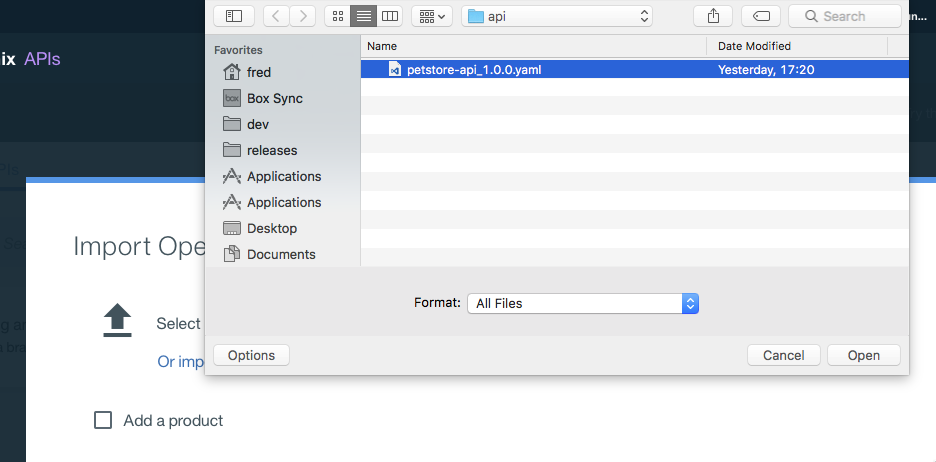

1. Click Import

### Configure API properties

1. Select Properties

   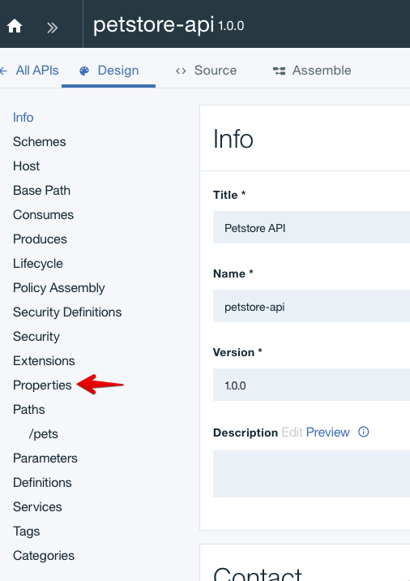

1. Fill in the Auth0 ID and OpenWhisk credentials by setting a default value for auth0Id, openwhiskUsername and openwhiskPassword

   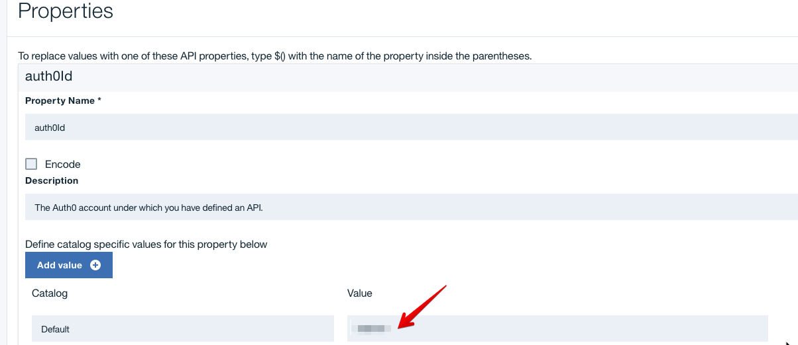

1. Save

### Publish the API

1. Select "Generate a default product"

   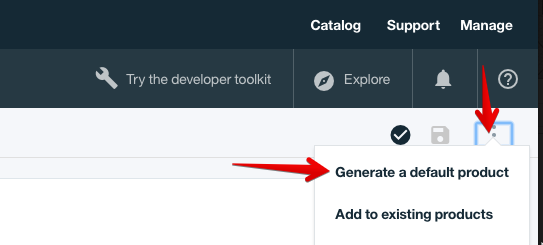

1. Leave the defaults and click Create product

1. Wait a minute or so for the API to be published to the Sandbox

### Test the API

1. Retrieve your API Connect endpoint under Dashboard / Settings / Gateways

   

1. Access the `GET /pets` endpoint

   ```
   curl -v -H "Content-Type: application/json" https://api.us.apiconnect.ibmcloud.com/<org>-<space>/sb/petstore/v1/pets
   ```

1. As expected, it fails with `JWT validation failed` as we did not specified a valid OAuth token to validate our access:

   ```
   { "httpCode":"500", "httpMessage":"Invalid-JWT-Validate", "moreInformation":"JWT validation failed" }
   ```

1. Call the API again but this time passing the access_token obtained in the Test section of Auth0 in a previous step

   ```
   curl -v -H "Authorization: Bearer <access_token>" -H "Content-Type: application/json" https://api.us.apiconnect.ibmcloud.com/<org>-<space>/sb/petstore/v1/pets
   ```

1. It returns pets

   ```
   {"pets":[{"id":90720,"name":"brownie"},{"id":456,"name":"doggie"},{"id":1968,"name":"Brady"},{"id":654646,"name":"doggie"}]}
   ```

1. Access the POST /pets endpoint with the token

   ```
   curl -v -X POST --data '{"name": "titus"}' -H "Authorization: Bearer <access_token>" -H "Content-Type: application/json" https://api.us.apiconnect.ibmcloud.com/<org>-<space>/sb/petstore/v1/pets
   ```

1. It adds a new pet

   ```
   {"id":1502210136538,"name":"titus"}
   ```

## Code Structure

| File | Description |
| ---- | ----------- |
|[**api/petstore-api_1.0.0.yaml**](api/petstore-api_1.0.0.yaml)| API definition for API Connect. |
|[**actions**](actions)|GET and POST implementation. As there is no database, the implementation is only a mock.|
|[**deploy.sh**](deploy.sh)|Helper script to install, uninstall, update the OpenWhisk actions used by the application.|

## License

See [License.txt](License.txt) for license information.

## Credits

Credits to <a href="https://www.linkedin.com/in/ozairsheikh/">Ozair Sheikh</a> for his article on <a href="https://developer.ibm.com/apiconnect/2017/06/16/protect-access-to-api-services-with-auth0-jwt/">protecting access to API services using Auth0</a> and <a href="https://twitter.com/thomasj">James Thomas</a> for his instructions <a href="http://jamesthom.as/blog/2016/04/26/serverless-apis-with-openwhisk-and-api-connect/">to expose OpenWhisk actions with API Connect</a>.

---

This project is a sample application. The program is provided as-is with no warranties of any kind, express or implied.

[bluemix_signup_url]: https://console.ng.bluemix.net/?cm_mmc=GitHubReadMe
